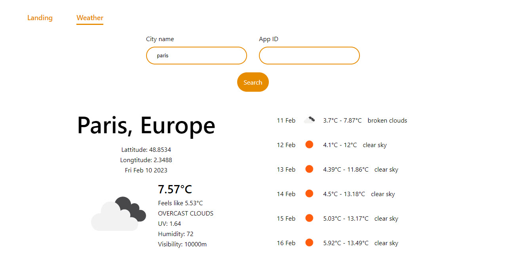

# Weather
[Weather](https://weather-dinh.vercel.app/) is an application which permits to look for the weather forecast in a city.




## Table of contents
* How to install and Run Weather application
    * Clone Weather
    * Install necessary modules
    * Run Weather
* Weather application's tructure
* How to use Weather
    * Cities list
    * City details


## How to install and Run Weather application
### Clone and install
To clone and run this application, you'll need [Git](https://git-scm.com) and [Node.js](https://nodejs.org/en/download/) (which comes with [npm](http://npmjs.com)) installed on your computer. From your command line:

```bash
# Clone this repository
$ git clone https://github.com/Quang-Tuyen-DINH/weather-app.git

# Go into the directory
$ cd weather-app
```

### Install necessary modules
While in the application directory

```bash
# Install dependencies
$ npm install
```

### Run Weather
To start the application

```bash
# Run the app
$ npm run start
```

## Weather application's structure
```bash
root/
├─ public/
├─ src/
│  ├─ assets/
│  ├─ components/
│  │  ├─ forms/
│  │  ├─ ui/
│  ├─ pages/
│  ├─ routes/
│  ├─ services/
│  │  ├─ openweathermap/
│  ├─ shared/
│  │  ├─ models/
├─ .env
├─ package.json
├─ tsconfig.json
```

## How to use Weather
From Landing Page `http://localhost:3000/`, user can access to Weather page `http://localhost:3000/weather` by clicking the `Weather` button in navigation bar

### Cities List
At the Catalogue page `http://localhost:3000/catalogue`, user need an API key and the keyword to search for the desired city, in order to do that, user has to register the API key at `https://home.openweathermap.org/`.

After filling the city name and the API key, user can hit the Search button, then a list of cities will appear with the city name and zone for a quick overview, and user will be able to click on the prefered city card for more details.

### City details
By clicking a card, the application will show more details about the choosen city such as temperature, humidity, visibility, etc.